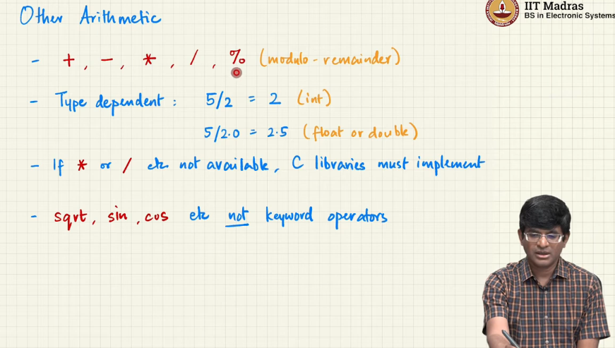
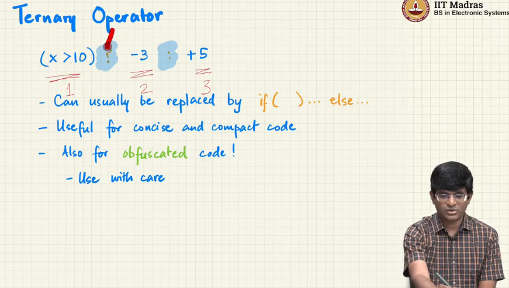
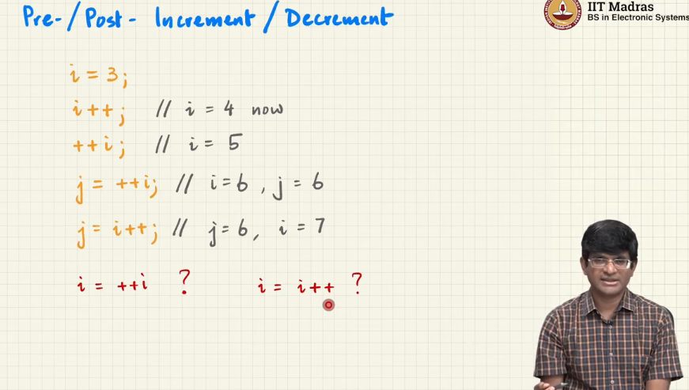
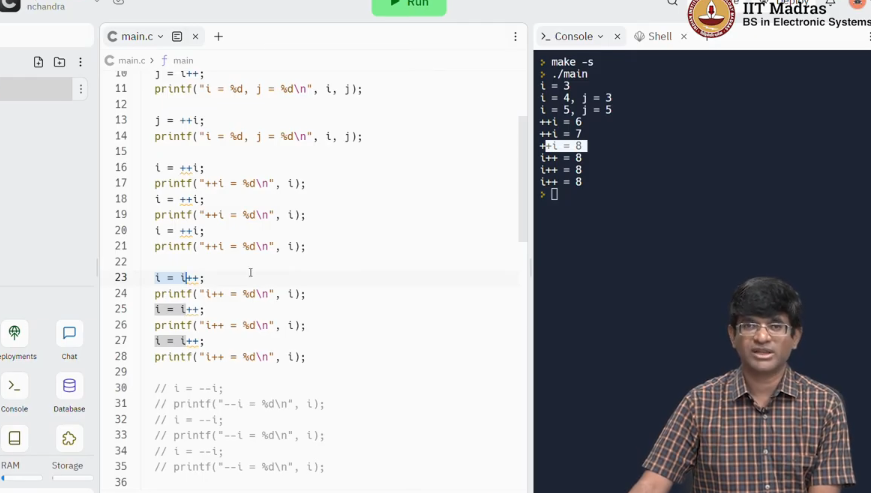
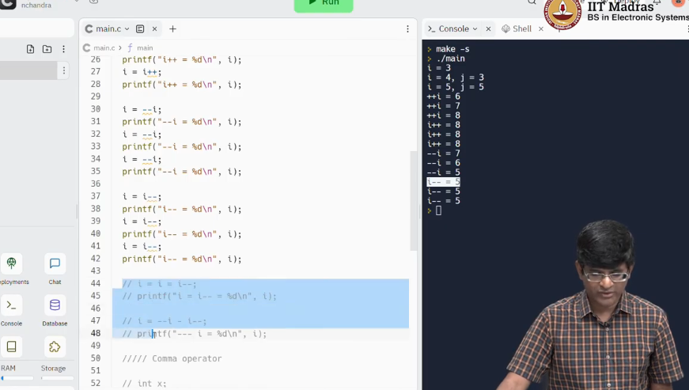
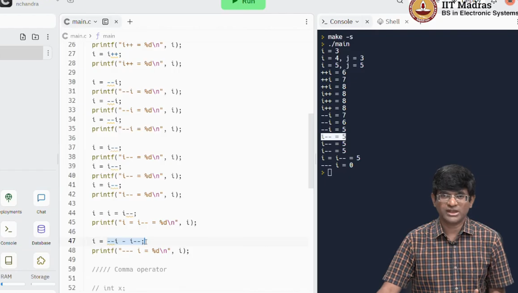
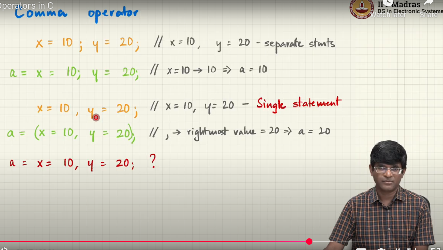
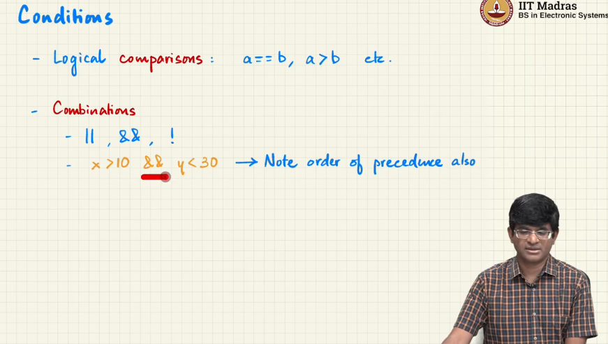
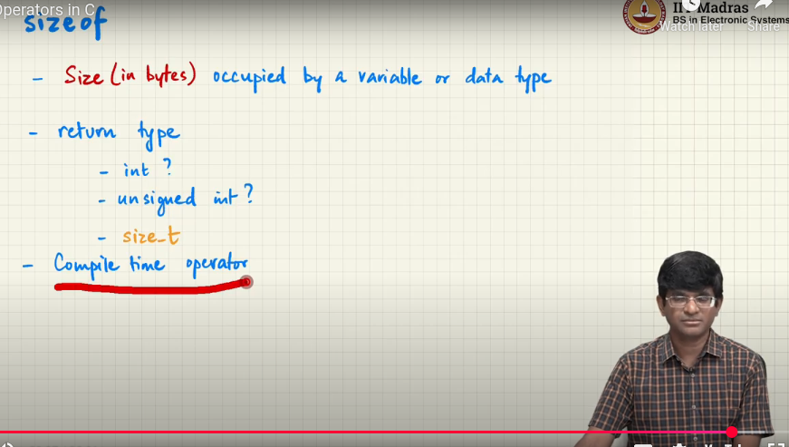

# Operator in C

- computation
- update values
- closely related to functions

- C does not allow Operator Overloading(Cannot Redefine the meaning of an operator for user-defined data types)

- pre increment will increment the value and then use it in the expression
- post increment will use the value in the expression and then increment it, 
- i=i++ will not work as expected because the value of i is used first and then incremented, but the incremented value is not assigned back to i.

# Comman Operators in C

a=x=10,y=20; is equivalent to a=(x=10,y=20); which means x is assigned 10, y is assigned 20 and the value of the expression is the value of y which is 20. So `a` will be assigned `20`.

# Conditions     

# Note : 
    - sizepf() is not a function in C, it is a compile time operator.
    - sizeof() returns the size in bytes of the data type or variable.
    - size_t is an unsigned integer type returned by sizeof operator.