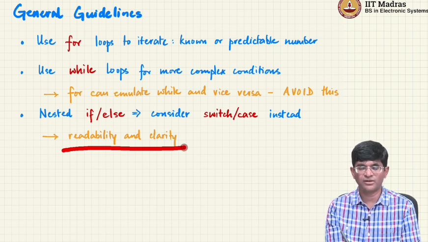
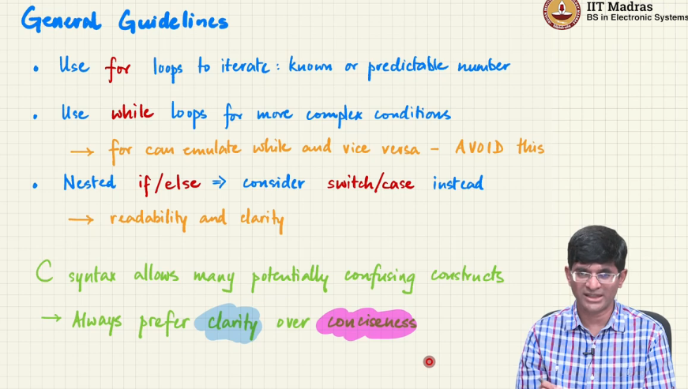
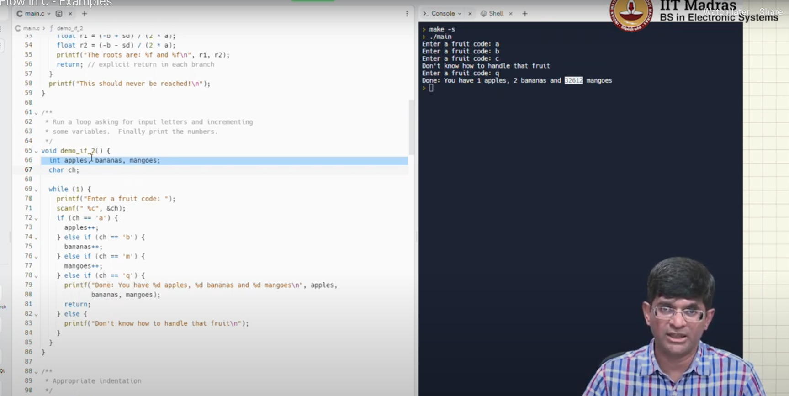
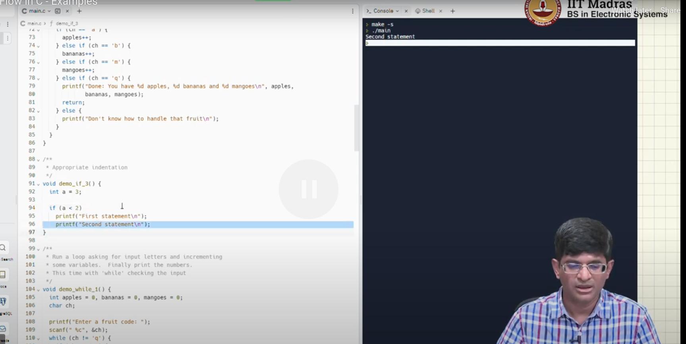
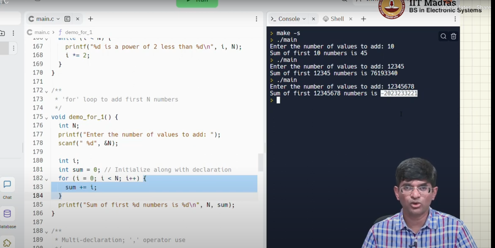
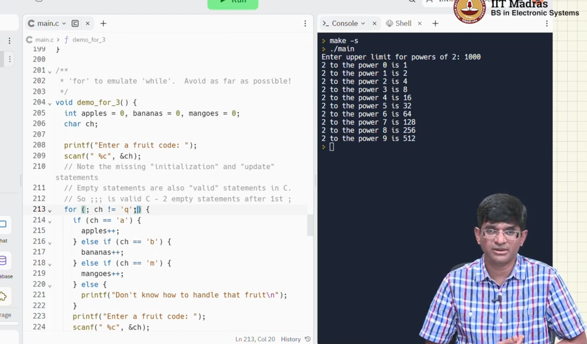
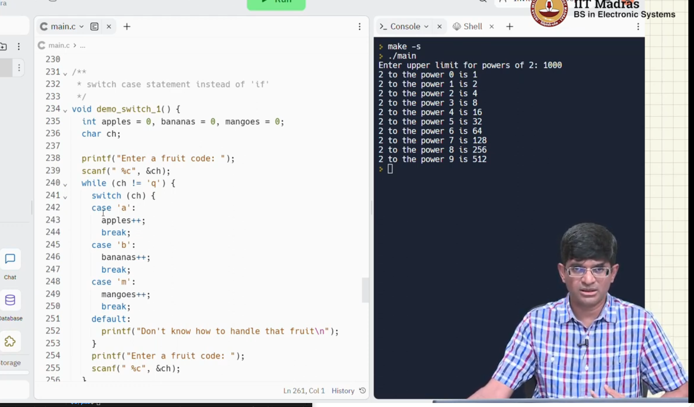
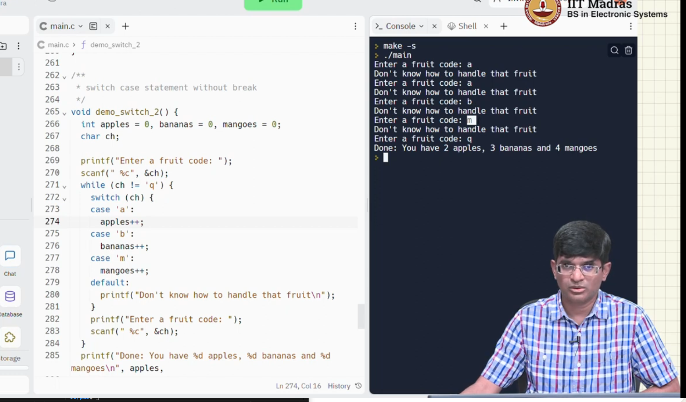

- check the values for mangoes, if we are not initializing , we will get garbage values. , so we should always declare and initialize at the same time to avoid confusion

- if condition without bracket will only take one statement, and other will be out of the condition

- check for negative number , its because of 2's complement, because only 32 bits can be stored, and 1 is the most significant bit after a point

check the for loops `for(;ch!='q';)` , its allowed, and its equivalent to while loop

- guess why it failed, becuase of `break` statement