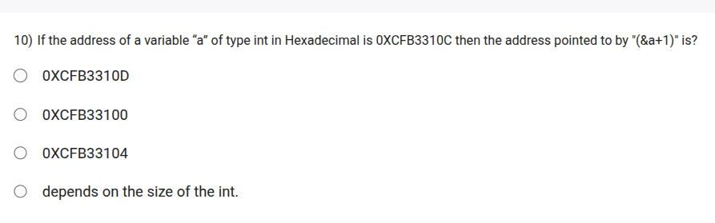

```
&a =>0XCFB3310C
then 
&a+1=>?
0XCFB33110C+sizeof(int)=0XCFB33110C+4=0XCFB33110C
so the address increments by 4 because int is of 4 bytes

```

TLDR:
- Address of `a` is given as 0XCFB3310C
    - 0XCFB3310C + 1*(size of int)
    - 0XCFB3310C + 1*4 = 0XCFB33110 (if size of int is 4 bytes)

    - few systems may have different size for int (2 bytes or 8 bytes), so the answer is "depends on the size of int"
    - eg : if size of int is 2 bytes, eg systenm with 16 bit architecture
          - size of int is 4 bytes, eg system with 32 bit architecture
            - size of int is 8 bytes, eg system with 64 bit architecture

Let's analyze carefully 👇

Given:

* Address of variable `a` (of type `int`) = **0xCFB3310C**
* Expression: `&a + 1`
* Question: What address does it point to?

---

### Step 1: Understand what `&a + 1` means

* `&a` → gives the address of the variable `a`.
* `&a + 1` → moves **forward by 1 unit of `int` size** (not 1 byte).

---

### Step 2: Determine size of `int`

* On most systems, `int` is **4 bytes**.

So:
[
&a + 1 = 0xCFB3310C + 4\text{ bytes}
]

---

### Step 3: Calculate new address

[
0xCFB3310C + 0x4 = 0xCFB33110
]

---

✅ **Answer:** `0xCFB33110`

If the question’s options are:

* 0XCFB3310D
* 0XCFB33100
* 0XCFB33104
* depends on the size of int

👉 The **correct choice is:**
**“depends on the size of the int”**,
because `&a + 1` adds **sizeof(int)** bytes — usually 4, but not guaranteed on every system.
